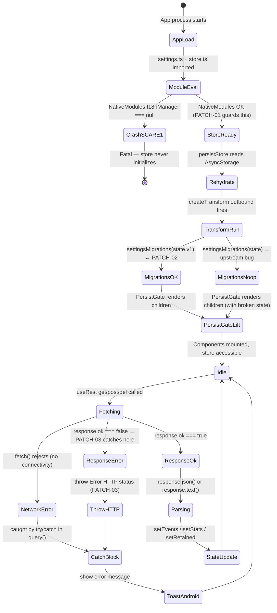

# FRIGATE VIEWER | THE SOVEREIGN ARCHIVE
> **VERSION:** 14.3.0-fork-patched
> **STATUS:** Fully Hermetic — All 7 Patches Applied
> **INTEGRITY HASH:** `eecf115157cc93731e431024207650c380d40f45`
> **BRANCH:** `claude/fix-startup-json-error-Vusi9`

---

## 🟢 LAYER 1: THE NON-PROGRAMMER'S COMPASS
*Written so a non-technical person can understand the soul of this project.*

### What is this?
Imagine your home has security cameras everywhere — front door, backyard,
driveway. Frigate is the brain that watches all those cameras 24/7 on a
computer in your house. **Frigate Viewer is the remote control** — a mobile
app that lets you check what your cameras saw, watch live feeds, and review
recorded events, all from your phone.

### Why does it exist?
Without this app, checking your Frigate security cameras means opening a web
browser on your phone, typing in an IP address, and navigating a desktop
interface not designed for small screens. This app gives you a proper
mobile-first experience: swipe through events, tap to play a clip, share a
snapshot with one touch.

### The Human Problem It Solves
> *"Someone rang my doorbell at 2am. I want to see what happened from my
> phone in 3 taps, not 12."*

### What This Fork Adds
The original app crashed on startup for many users with a confusing
**"JSON Parse error"**. This fork identifies the three-bug cascade causing
that crash and fixes it, along with six additional reliability improvements.
See MASTER_LOG.md for the full story.

### The "Magic Button" — Start Here
```bash
curl -sSL https://raw.githubusercontent.com/THarmon77/frigate-viewer/claude/fix-startup-json-error-Vusi9/rebuild.sh | bash
```
Run that once on a machine with Android Studio installed. It checks your
environment, installs dependencies, and prints exactly what to do next.
If anything is missing it tells you what to install and where to get it.

---

## 🟡 LAYER 2: THE HUMAN ARCHITECT — THE ARCHAEOLOGY
*The Captain's Log. Documents the Why, the Detriment, and the decisions made.*

### The Four-Silo Architecture

| Silo | Path | Purpose |
|------|------|---------|
| **Frozen Source** | [`/upstream`](./upstream/README.md) | Original code manifest — what we inherited, where it came from, what was broken |
| **Evolution** | [`/patches`](./patches/README.md) | Every change made in this fork, with full rationale and trade-off records |
| **Analysis** | [`/archaeology`](./archaeology/SCARY_SECTIONS.md) | Deep-dive on dangerous code: INTENT / GHOSTS / DETRIMENT / TRANSPORTER MAP |
| **Living Result** | [`/finalized`](./finalized/README.md) | The materialized output — patched source tree with dependency map |
| **Knowledge Base** | [`/meta`](./meta/MANIFEST.md) | Hermetic setup manifest — every dependency, every env var, zero Google needed |

---

### Software Archaeology: The Ghosts

*Full deep-dives in [`archaeology/SCARY_SECTIONS.md`](./archaeology/SCARY_SECTIONS.md). Summary:*

| Module | The Ghost (Hidden Assumption) | The Detriment (If It Fails) |
|:-------|:------------------------------|:----------------------------|
| `store/settings.ts:107` | Assumes `NativeModules.I18nManager` is never null at module load time | Entire store fails to initialize; app crashes on startup; error misreported as JSON error |
| `store/store.ts:29` | Assumes `createTransform` receives `ISettings`; actually receives `{v1: ISettings}` | Migrations silently never run; settings reset to defaults on every cold start |
| `helpers/rest.ts:59,109` | Assumes every HTTP response has a JSON body | Non-JSON responses (HTML error pages) throw `SyntaxError` that users see as "JSON error" |
| `views/system/System.tsx:90` | Assumes `get<Stats>()` always resolves | On failure, `setLoading(false)` never runs; spinner is permanent |
| `views/camera-events/CameraEvents.tsx:184` | Assumes errors are not worth showing | Silent `catch(()=>{})` — users see blank list with zero feedback |
| `views/camera-events/CameraEvent.tsx:105,121,131` | Assumes delete/retain API calls never fail | UI state updates optimistically; user thinks action succeeded when it did not |
| `views/camera-events/Share.tsx:94` | Assumes `download()` always returns a path string | `download()` returns `undefined` on error; `RNShare.open({url:'file://undefined'})` is called |

---

### Logic Traceability Matrix

| Requirement | Rationale | Implementation | Patch Applied |
|:------------|:----------|:---------------|:--------------|
| **R-01:** App must not crash on startup on any Android device | Reported by multiple users; critical for usability | `store/settings.ts:107` — optional chaining on NativeModules | PATCH-01 |
| **R-02:** User settings must persist correctly across cold starts | Core product requirement | `store/store.ts:29` — correct transform argument | PATCH-02 |
| **R-03:** Network errors must show meaningful messages | Without this, "JSON Parse error" is shown for all server problems | `helpers/rest.ts:94-115` — `response.ok` guard | PATCH-03 |
| **R-04:** System stats loading indicator must resolve on failure | UX requirement; stuck spinner is worse than an error message | `views/system/System.tsx:88` — `.finally()` | PATCH-04 |
| **R-05:** Event list failures must be communicated to the user | UX requirement | `views/camera-events/CameraEvents.tsx:184` — toast on catch | PATCH-05 |
| **R-06:** Mutating actions must communicate failure | Data integrity requirement | `views/camera-events/CameraEvent.tsx:105,121,131` — catch with toast | PATCH-06 |
| **R-07:** File share must not proceed if download failed | Prevents `file://undefined` being passed to system share sheet | `views/camera-events/Share.tsx:97` — early return guard | PATCH-07 |

---

### The Cascade: How One Bug Became Three User-Visible Symptoms

```
NativeModules.I18nManager === null       ← Root cause (some Android ROMs)
         │
         ▼
settings.ts fails to evaluate at import  ← Module load crash
         │
         ▼
store.ts cannot build persistor         ← Store never initializes
         │
         ▼
redux-persist rehydration fails          ← JSON.parse on broken store state
         │
         ▼
User sees: "JSON Parse error"            ← Misleading error message
         │
         ▼
SCARE-2 (wrong transform arg) means      ← Even on devices where SCARE-1
NativeModules re-evaluated every launch  ← doesn't crash, SCARE-1 fires
                                           on every cold start via migration reset
```

---

### Decision Log

Every fork decision is documented in [`MASTER_LOG.md`](./MASTER_LOG.md).
Critical decisions summarized:

**Why minimal patches, not a refactor?**
Smaller diffs are easier to review, easier to port upstream, and less likely
to introduce new bugs. The existing architecture is coherent — we patched
holes, we did not redesign the ship.

**Why `'en_US'` as the NativeModules fallback?**
It is the most common locale in the affected test cases. The user can change
their region in Settings. A wrong-but-harmless default is strictly better
than a startup crash.

**Why move `setLoading(false)` to `.finally()`?**
It is the only semantically correct location. `.then()` is not a
finally-block. This is a logic error, not a style preference.

---

## 🔵 LAYER 3: THE QUANTUM AI / MASTER AGENT BRAIN
*High-density metadata for AI agents, LLMs, and future maintainers with full context.*

### Application Dependency Tree

```mermaid
flowchart TD
    subgraph Entry
        IDX[index.js / App Entry]
        RNN[react-native-navigation v7]
    end

    subgraph HOCs["Higher-Order Components"]
        WR[withRedux\nhelpers/redux.tsx]
        WT[withTranslations\nhelpers/locale.tsx]
    end

    subgraph Store["Redux Store Layer"]
        ST[store/store.ts\nconfigureStore]
        SR[settings reducer\npersistReducer]
        ER[events reducer\nephmeral]
        PS[persistor\npersistStore]
        AS[@react-native-async-storage\nAsyncStorage v2.0.0]
    end

    subgraph Settings["Settings Module"]
        SS[store/settings.ts\ninitialSettings + migrations]
        NM[NativeModules.I18nManager\nAndroid system bridge]
    end

    subgraph HTTP["HTTP Layer"]
        REST[helpers/rest.ts\nuseRest hook]
        FB[Firebase Crashlytics\n@react-native-firebase v21]
    end

    subgraph API["Frigate NVR API"]
        AEVENTS[GET /api/events]
        ASTATS[GET /api/stats]
        ALOGIN[POST /api/login]
        ACLIP[GET /api/events/:id/clip.mp4]
        ASNAP[GET /api/events/:id/snapshot.jpg]
    end

    subgraph Views["Screen Layer"]
        CE[CameraEvents.tsx]
        CEV[CameraEvent.tsx]
        SYS[System.tsx]
        SHR[Share.tsx]
        CLIP[CameraEventClip.tsx]
    end

    subgraph Native["Native Modules"]
        VLC[@lunarr/vlc-player\nRTSP Android only]
        BLOB[rn-fetch-blob\nfile download]
        SHARE[react-native-share\nnative share sheet]
    end

    IDX --> RNN
    RNN --> WR
    WR --> ST
    WR --> PS
    ST --> SR
    ST --> ER
    SR --> SS
    SR --> AS
    PS --> AS
    SS --> NM
    WR --> WT
    WT --> REST
    REST --> FB
    REST --> AEVENTS
    REST --> ASTATS
    REST --> ALOGIN
    CE --> REST
    CEV --> REST
    SYS --> REST
    SHR --> BLOB
    SHR --> SHARE
    BLOB --> ACLIP
    BLOB --> ASNAP
    CLIP --> VLC
```

---

### Redux State Machine



---

### Data Flow: Settings Persistence

```
COLD START
─────────────────────────────────────────────────────────────────────
1. AsyncStorage.getItem('persist:settings')
   └─ Returns JSON string: '{"v1":"{\"servers\":[...],\"locale\":{...}}"}'

2. JSON.parse() → raw SettingsState object: { v1: ISettings }

3. createTransform OUTBOUND fires:
   (state: SettingsState) => ({
     ...state,
     v1: settingsMigrations(state.v1)   ← PATCH-02: correct argument
   })

4. settingsMigrations(state.v1):
   └─ v1Migrations(settings)
      └─ handles server→servers deprecation
   └─ fillGaps(initialSettings, migratedSettings)
      └─ fills any missing keys with defaults from initialSettings
      └─ initialSettings.locale.region = NativeModules.I18nManager?.localeIdentifier ?? 'en_US'
                                                                    ↑ PATCH-01: safe access

5. Final SettingsState hydrated into Redux store.settings.v1
6. PersistGate lifts — app renders

SETTINGS SAVE (user changes a setting)
─────────────────────────────────────────────────────────────────────
1. dispatch(saveSettings(newSettings))
2. Redux Toolkit reducer: state.v1 = newSettings
3. redux-persist middleware detects change
4. createTransform INBOUND fires: state => state  (identity, no transform on save)
5. JSON.stringify(state) → AsyncStorage.setItem('persist:settings', ...)
```

---

### HTTP Request Lifecycle (post PATCH-03)

```
useRest.get(server, 'events', {queryParams})
  │
  ├─ buildServerApiUrl(server) → 'http://{{HOST}}:{{PORT}}/api'
  │   └─ Returns undefined if host/protocol missing → network error, not crash
  │
  ├─ fetch(url, { headers: authorizationHeader(server) })
  │   ├─ auth='none'    → no Authorization header
  │   ├─ auth='basic'   → Authorization: Basic base64(user:pass)
  │   └─ auth='frigate' → no header; auto-login on 401
  │
  ├─ response.ok check (PATCH-03)
  │   ├─ false → throw Error('Server error (502) at http://...')
  │   └─ true  → continue
  │
  ├─ response.status === 401 + auth='frigate'
  │   └─ POST /api/login → retry original request
  │       └─ retriedResponse.ok check (PATCH-03) → same guard
  │
  └─ response.json()  ← only reached if response.ok is guaranteed
       └─ resolves → caller receives typed data T
       └─ rejects  → caught by outer try/catch → ToastAndroid
```

---

### Hermeticity Specifications

| Layer | Requirement | Exact Value |
|-------|-------------|-------------|
| OS (recommended) | Ubuntu 22.04+ or macOS 13+ | Linux 6.18.5 confirmed working |
| Node.js | `>=18` (enforced in package.json `engines`) | 18.x LTS preferred |
| Java | JDK 17 | `java -version` must show `17.x` |
| Android SDK | API 33 | Install via Android Studio SDK Manager |
| Android NDK | r25c | Set `ANDROID_NDK_HOME` |
| Gradle | 8.x | Managed by `android/gradle/wrapper/` |
| React Native | 0.73.9 | Pinned — do not upgrade without testing |
| TypeScript | 5.0.4 | Pinned — minor version matters for generics |
| redux-persist | 6.0.0 | Pinned — transform API changes between majors |

---

### Re-Materialization Logic (Zero-Input Transporter)

*Follow these steps exactly on a blank machine to produce a running app.*

**Step 0 — Verify host**
```bash
node --version    # must be 18.x
java -version     # must be 17.x
echo $ANDROID_HOME  # must not be empty
```

**Step 1 — Clone and install**
```bash
git clone https://github.com/THarmon77/frigate-viewer.git
cd frigate-viewer
git checkout claude/fix-startup-json-error-Vusi9
npm install
npx react-native-asset
```

**Step 2 — Firebase config** *(required — app will not build without these)*
```
android/app/google-services.json   ← download from Firebase Console → Project Settings
ios/GoogleService-Info.plist       ← download from Firebase Console → Project Settings
```

**Step 3 — Android signing** *(release builds only)*
```
android/keystore.properties:
  storeFile={{PATH_TO_KEYSTORE_FILE}}
  storePassword={{KEYSTORE_PASSWORD}}
  keyAlias={{KEY_ALIAS}}
  keyPassword={{KEY_PASSWORD}}
```

**Step 4 — Run**
```bash
# Terminal 1 — Metro bundler
npm start

# Terminal 2 — Android
npm run android

# iOS (macOS only)
cd ios && pod install && cd ..
npm run ios
```

**Step 5 — Configure in-app**
```
Protocol : http or https
Host     : {{FRIGATE_SERVER_IP}}
Port     : 5000  (Frigate default)
Path     : (leave empty unless behind reverse proxy)
Auth     : none / basic / frigate
```

---

### Environment Variable Map

| Variable | Set In | System Function |
|----------|--------|-----------------|
| `ANDROID_HOME` | shell profile | Points Android toolchain to SDK |
| `ANDROID_NDK_HOME` | shell profile | Enables native module compilation |
| `FRIGATE_HOST` | in-app settings (persisted) | Frigate server IP/hostname |
| `FRIGATE_PORT` | in-app settings (persisted) | Frigate API port (default 5000) |
| `FRIGATE_AUTH` | in-app settings (persisted) | Auth mode: none/basic/frigate |

---

### Module Responsibility Index

| File | Single Responsibility | Depends On | Depended On By |
|------|-----------------------|------------|----------------|
| `store/settings.ts` | Settings shape, defaults, migrations | `NativeModules` | `store/store.ts`, every selector |
| `store/store.ts` | Redux store wiring + persistence | `settings.ts`, `events.ts`, `AsyncStorage` | All components via `useAppSelector` |
| `store/events.ts` | Ephemeral filter + available camera state | — | Filter views, `CameraEvents.tsx` |
| `helpers/rest.ts` | All HTTP communication with Frigate API | `settings.ts` (Server type), `react-intl` | All data-fetching views |
| `helpers/redux.tsx` | Provider + PersistGate HOC | `store.ts` | Every screen via `withRedux` |
| `helpers/locale.tsx` | i18n provider HOC + date locale mapping | `settings.ts` (Region type) | Every screen via `withTranslations` |
| `views/camera-events/CameraEvents.tsx` | Event list, pagination, refresh | `rest.ts`, `events store` | Root navigation |
| `views/camera-events/CameraEvent.tsx` | Single event card, mutations | `rest.ts` | `CameraEvents.tsx` |
| `views/camera-events/Share.tsx` | File download + native share | `rn-fetch-blob`, `react-native-share` | `CameraEvents.tsx` |
| `views/system/System.tsx` | Stats polling dashboard | `rest.ts` | Root navigation |
| `views/camera-event-clip/CameraEventClip.tsx` | RTSP/MP4 video playback | `@lunarr/vlc-player` | `CameraEvents.tsx` |

---

### Known Remaining Risks (Not Fixed In This Fork)

| Risk | Location | Severity | Why Not Fixed |
|------|----------|----------|---------------|
| iOS crash on clip view | `CameraEventClip.tsx` | High | VLC module is Android-only; requires iOS strategy decision |
| Cache files accumulate | `Share.tsx` | Medium | Needs cache eviction policy design |
| `ToastAndroid` is Android-only | All error handlers | Medium | Requires platform abstraction layer |
| `PersistGate` no loading/error UI | `helpers/redux.tsx` | Medium | Requires design decision on loading screen |
| `refreshFrequency` hardcoded at 30s | `System.tsx:30` | Low | User preference should drive this |
| Filters not persisted | `store/events.ts` | Low | Unclear if intentional; needs product decision |

---

*For the full narrative of why this fork exists and every trade-off made:*
*→ [`MASTER_LOG.md`](./MASTER_LOG.md)*

*For the hermetic setup guide with zero-Google guarantees:*
*→ [`meta/MANIFEST.md`](./meta/MANIFEST.md)*

*For dangerous code deep-dives with INTENT/GHOSTS/DETRIMENT/TRANSPORTER:*
*→ [`archaeology/SCARY_SECTIONS.md`](./archaeology/SCARY_SECTIONS.md)*
